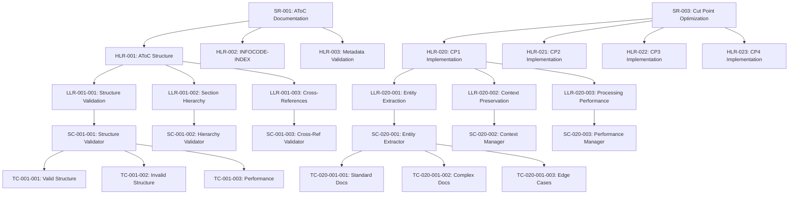

---

`<p align="center">
  
  <br>
  <em>Transforming Aerospace Documentation & Design</em>
</p>
````## Additional Documentation Recommendations

To complement this README, I recommend creating the following additional documentation files:

1. **Architecture Overview Document**

1. Detailed system architecture diagrams
2. Component interactions
3. Data flow descriptions
4. Technology stack details


2. **AToC Integration Guide**

1. How GAIA-Q-UI implements the AToC framework
2. Document structure and metadata requirements
3. INFOCODE-INDEX usage guidelines
4. Cut point optimization details


3. **Compliance Documentation**
### Compliance Documentation for GAIA-Q-UI
## Overview

This document outlines the compliance approach for the GAIA-Q-UI system with respect to aerospace industry standards and regulations. It serves as the master reference for all certification and compliance activities within the project.

## Applicable Standards

| Standard | Description | Applicability |
|----------|-------------|---------------|
| **DO-178C** | Software Considerations in Airborne Systems and Equipment Certification | Core software components |
| **DO-254** | Design Assurance Guidance for Airborne Electronic Hardware | Hardware interface components |
| **DO-278A** | Software Integrity Assurance for Ground Systems | Ground-based components |
| **ARP4754A** | Guidelines for Development of Civil Aircraft and Systems | System development lifecycle |
| **ARP4761** | Guidelines and Methods for Safety Assessment | Safety assessment processes |
| **MIL-STD-498** | Software Development and Documentation | Documentation structure |
| **ISO/IEC 25010** | Systems and Software Quality Requirements and Evaluation | Quality assurance |
| **RTCA/DO-160G** | Environmental Conditions and Test Procedures for Airborne Equipment | Environmental testing |

## Software Level Assignments

GAIA-Q-UI components are assigned the following Design Assurance Levels (DAL) based on their function and potential failure impact:

| Component | DAL | Rationale |
|-----------|-----|-----------|
| Documentation Generation | Level D | Operational convenience, minimal safety impact |
| Compliance Checking | Level C | Could indirectly affect safety through incorrect compliance verification |
| Design Validation | Level C | Could indirectly affect safety through incorrect design validation |
| Knowledge Graph | Level D | Operational convenience, minimal safety impact |
| Cut Point Implementation | Level C | Information transfer integrity affects system reliability |
| User Interface | Level D | Operational convenience, minimal safety impact |
| Integration Services | Level C | System integration affects overall reliability |

## Compliance Strategy

### 1. Planning Phase

#### 1.1 Plan for Software Aspects of Certification (PSAC)
- [Link to PSAC Document](./psac.md)
- Outlines compliance approach for DO-178C
- Defines software lifecycle processes
- Establishes verification methods

#### 1.2 Software Development Plan (SDP)
- [Link to SDP Document](./sdp.md)
- Defines development methodology
- Establishes configuration management
- Outlines quality assurance processes

#### 1.3 Software Verification Plan (SVP)
- [Link to SVP Document](./svp.md)
- Defines verification methods and criteria
- Establishes test coverage requirements
- Outlines review processes

### 2. Development Phase

#### 2.1 Requirements Traceability
All requirements are traced through the development lifecycle:

- High-Level Requirements (HLR) → Low-Level Requirements (LLR) → Source Code → Test Cases
- [Link to Requirements Traceability Matrix](./traceability-matrix.md)

#### 2.2 Configuration Management
- All artifacts are under configuration management
- Version control using Git with signed commits
- Change management process with approval workflows
- [Link to Configuration Management Plan](./configuration-management.md)

#### 2.3 Quality Assurance
- Independent verification of compliance activities
- Audit trails for all development activities
- [Link to Quality Assurance Plan](./quality-assurance.md)

### 3. Verification Phase

#### 3.1 Reviews
- Requirements reviews
- Design reviews
- Code reviews
- Test procedure reviews
- [Link to Review Procedures](./review-procedures.md)

#### 3.2 Testing
- Requirements-based testing
- Structural coverage analysis
- Integration testing
- System testing
- [Link to Test Plan](./test-plan.md)

#### 3.3 Analysis
- Control flow analysis
- Data flow analysis
- Worst-case execution time analysis
- Memory usage analysis
- [Link to Analysis Procedures](./analysis-procedures.md)

### 4. Certification Phase

#### 4.1 Software Conformity Review
- Verification of all lifecycle data
- Confirmation of compliance with plans
- [Link to Conformity Review Checklist](./conformity-review.md)

#### 4.2 Final Certification Documentation
- Software Accomplishment Summary (SAS)
- System Safety Assessment (SSA)
- [Link to Certification Package Index](./certification-package.md)

## Compliance Verification Matrix

The following matrix maps GAIA-Q-UI features to compliance requirements:

| Feature | DO-178C Objectives | Verification Method | Status |
|---------|-------------------|---------------------|--------|
| Documentation Generation | Table A-1 #1-10 | Requirements-based testing | In Progress |
| Compliance Checking | Table A-2 #1-13 | Requirements-based testing, Analysis | In Progress |
| Design Validation | Table A-3 #1-9 | Requirements-based testing, Analysis | Not Started |
| Knowledge Graph | Table A-4 #1-13 | Requirements-based testing | Not Started |
| Cut Point Implementation | Table A-5 #1-10 | Requirements-based testing, Analysis | In Progress |
| User Interface | Table A-6 #1-7 | Requirements-based testing | In Progress |
| Integration Services | Table A-7 #1-9 | Integration testing | Not Started |

## Tool Qualification

The following tools require qualification according to DO-330:

| Tool | Purpose | Tool Qualification Level (TQL) | Status |
|------|---------|-------------------------------|--------|
| Static Analysis Tools | Verification | TQL-5 | In Progress |
| Test Automation Framework | Verification | TQL-4 | Not Started |
| Requirements Management Tool | Development | TQL-5 | Complete |
| Build Automation Tools | Development | TQL-5 | In Progress |

## Compliance Monitoring and Reporting

### Automated Compliance Checks
- Daily automated compliance checks via CI/CD pipeline
- Weekly compliance status reports
- Monthly comprehensive compliance reviews

### Compliance Dashboard
- Real-time compliance status visualization
- Traceability coverage metrics
- Test coverage metrics
- [Link to Compliance Dashboard](https://compliance-dashboard.example.com)

## Regulatory Submission Package

The following documents constitute the regulatory submission package:

1. System Description
2. Plan for Software Aspects of Certification (PSAC)
3. Software Development Plan (SDP)
4. Software Verification Plan (SVP)
5. Software Configuration Management Plan (SCMP)
6. Software Quality Assurance Plan (SQAP)
7. Software Requirements Specifications (SRS)
8. Software Design Documents (SDD)
9. Software Verification Cases and Procedures (SVCP)
10. Software Verification Results (SVR)
11. Software Life Cycle Environment Configuration Index (SECI)
12. Software Configuration Index (SCI)
13. Software Accomplishment Summary (SAS)

## Appendices

### Appendix A: Glossary of Terms
- [Link to Glossary](./glossary.md)

### Appendix B: Compliance Checklists
- [DO-178C Compliance Checklist](./checklists/do-178c.md)
- [DO-254 Compliance Checklist](./checklists/do-254.md)
- [ARP4754A Compliance Checklist](./checklists/arp4754a.md)

### Appendix C: Templates
- [Requirements Specification Template](./templates/requirements.md)
- [Test Case Template](./templates/test-case.md)
- [Review Record Template](./templates/review-record.md)
\`\`\`

```markdown type="code" file="docs/compliance/do-178c-checklist.md"
# DO-178C Compliance Checklist
````
## Purpose
This checklist provides a comprehensive verification tool for ensuring GAIA-Q-UI compliance with DO-178C objectives. It should be used throughout the development lifecycle to track compliance status.

## Instructions
1. For each objective, mark the status as:
   - **Complete**: Objective fully satisfied with evidence
   - **In Progress**: Work toward objective has begun
   - **Not Started**: Work has not yet begun
   - **N/A**: Objective not applicable to this component
2. Provide a link to evidence for each completed objective
3. For objectives in progress, provide an estimated completion date

## Software Planning Process (Table A-1)

| ID | Objective | Applicability by DAL | Status | Evidence | Notes |
|----|-----------|----------------------|--------|----------|-------|
| A-1-1 | Software development processes are defined | A-D | Complete | [SDP v1.2](../sdp.md) | Approved 2023-04-15 |
| A-1-2 | Software standards are defined | A-D | Complete | [Coding Standards v1.0](../standards/coding.md) | TypeScript and Python standards defined |
| A-1-3 | Software life cycle environment is defined | A-D | In Progress | [SLCE Draft](../slce-draft.md) | Est. completion: 2023-06-30 |
| A-1-4 | Additional considerations are addressed | A-D | In Progress | [Additional Considerations](../additional-considerations.md) | Tool qualification in progress |
| A-1-5 | Software development plan complies with certification plan | A-D | In Progress | [Compliance Analysis](../compliance-analysis.md) | Gap analysis in progress |
| A-1-6 | Development and verification standards comply with certification plan | A-D | In Progress | [Standards Compliance](../standards-compliance.md) | Est. completion: 2023-07-15 |
| A-1-7 | Software verification plan complies with certification plan | A-D | Not Started | - | Planned for Q3 2023 |
| A-1-8 | Software configuration management plan complies with certification plan | A-D | Not Started | - | Planned for Q3 2023 |
| A-1-9 | Software quality assurance plan complies with certification plan | A-D | Not Started | - | Planned for Q3 2023 |
| A-1-10 | Plans for software aspects of certification comply with certification plan | A-D | Not Started | - | Planned for Q4 2023 |

## Software Development Process (Table A-2)

| ID | Objective | Applicability by DAL | Status | Evidence | Notes |
|----|-----------|----------------------|--------|----------|-------|
| A-2-1 | High-level requirements are developed | A-D | In Progress | [HLR Document](../requirements/hlr.md) | 75% complete |
| A-2-2 | Derived high-level requirements are defined | A-D | In Progress | [Derived HLR](../requirements/derived-hlr.md) | 60% complete |
| A-2-3 | Software architecture is developed | A-D | In Progress | [Architecture Document](../architecture/overview.md) | Initial version complete |
| A-2-4 | Low-level requirements are developed | A-C | In Progress | [LLR Document](../requirements/llr.md) | 40% complete |
| A-2-5 | Derived low-level requirements are defined | A-C | Not Started | - | Dependent on LLR completion |
| A-2-6 | Source code is developed | A-D | In Progress | [GitHub Repository](https://github.com/example/gaia-q-ui) | Core modules implemented |
| A-2-7 | Executable object code is produced | A-D | In Progress | [Build System](../build/overview.md) | CI pipeline established |

## Verification of Outputs of Software Requirements Process (Table A-3)

| ID | Objective | Applicability by DAL | Status | Evidence | Notes |
|----|-----------|----------------------|--------|----------|-------|
| A-3-1 | High-level requirements comply with system requirements | A-D | In Progress | [Traceability Matrix](../traceability/system-to-hlr.md) | 70% complete |
| A-3-2 | High-level requirements are accurate and consistent | A-D | In Progress | [HLR Review Records](../reviews/hlr-reviews.md) | Initial review complete |
| A-3-3 | High-level requirements are verifiable | A-D | In Progress | [Verification Analysis](../verification/hlr-verifiability.md) | 65% complete |
| A-3-4 | High-level requirements conform to standards | A-D | In Progress | [Standards Compliance](../compliance/hlr-standards.md) | 80% complete |
| A-3-5 | High-level requirements are traceable to system requirements | A-D | In Progress | [Traceability Matrix](../traceability/system-to-hlr.md) | 70% complete |
| A-3-6 | Algorithms are accurate | A-D | Not Started | - | Planned for Q3 2023 |
| A-3-7 | High-level requirements are compatible with target computer | A-D | Not Started | - | Planned for Q3 2023 |

## Verification of Outputs of Software Design Process (Table A-4)

| ID | Objective | Applicability by DAL | Status | Evidence | Notes |
|----|-----------|----------------------|--------|----------|-------|
| A-4-1 | Low-level requirements comply with high-level requirements | A-C | Not Started | - | Dependent on LLR completion |
| A-4-2 | Low-level requirements are accurate and consistent | A-C | Not Started | - | Dependent on LLR completion |
| A-4-3 | Low-level requirements are verifiable | A-C | Not Started | - | Dependent on LLR completion |
| A-4-4 | Low-level requirements conform to standards | A-C | Not Started | - | Dependent on LLR completion |
| A-4-5 | Low-level requirements are traceable to high-level requirements | A-C | Not Started | - | Dependent on LLR completion |
| A-4-6 | Algorithms are accurate | A-C | Not Started | - | Planned for Q4 2023 |
| A-4-7 | Low-level requirements are compatible with target computer | A-C | Not Started | - | Planned for Q4 2023 |
| A-4-8 | Software architecture is compatible with high-level requirements | A-D | In Progress | [Architecture Analysis](../architecture/hlr-compatibility.md) | Initial analysis complete |
| A-4-9 | Software architecture is consistent | A-D | In Progress | [Architecture Review](../reviews/architecture-review.md) | Initial review complete |
| A-4-10 | Software architecture is compatible with target computer | A-D | In Progress | [Target Compatibility](../architecture/target-compatibility.md) | Initial assessment complete |
| A-4-11 | Software architecture is verifiable | A-C | Not Started | - | Planned for Q3 2023 |
| A-4-12 | Software architecture conforms to standards | A-D | In Progress | [Standards Compliance](../compliance/architecture-standards.md) | 60% complete |
| A-4-13 | Software partitioning integrity is confirmed | A-B | Not Started | - | Planned for Q4 2023 |

## Verification of Outputs of Software Coding & Integration Processes (Table A-5)

| ID | Objective | Applicability by DAL | Status | Evidence | Notes |
|----|-----------|----------------------|--------|----------|-------|
| A-5-1 | Source code complies with low-level requirements | A-D | Not Started | - | Dependent on LLR completion |
| A-5-2 | Source code complies with software architecture | A-D | In Progress | [Code Review Records](../reviews/code-architecture-compliance.md) | Initial reviews complete |
| A-5-3 | Source code is verifiable | A-D | In Progress | [Code Verifiability](../verification/code-verifiability.md) | Static analysis in progress |
| A-5-4 | Source code conforms to standards | A-D | In Progress | [Code Standards Compliance](../compliance/code-standards.md) | Automated checks implemented |
| A-5-5 | Source code is traceable to low-level requirements | A-C | Not Started | - | Dependent on LLR completion |
| A-5-6 | Source code is accurate and consistent | A-D | In Progress | [Code Review Records](../reviews/code-reviews.md) | Ongoing reviews |
| A-5-7 | Executable object code is compatible with high-level requirements | A-D | Not Started | - | Planned for Q4 2023 |
| A-5-8 | Executable object code is robust with high-level requirements | A-C | Not Started | - | Planned for Q4 2023 |
| A-5-9 | Verification of additional code that cannot be traced to source code | A-D | Not Started | - | Planned for Q4 2023 |
| A-5-10 | Verification of parameter data item files | A-D | Not Started | - | Planned for Q4 2023 |

## Testing Process (Table A-6)

| ID | Objective | Applicability by DAL | Status | Evidence | Notes |
|----|-----------|----------------------|--------|----------|-------|
| A-6-1 | Test procedures are correct | A-D | In Progress | [Test Procedure Reviews](../testing/procedure-reviews.md) | Initial procedures reviewed |
| A-6-2 | Test results are correct and discrepancies explained | A-D | In Progress | [Test Results](../testing/results.md) | Initial test results documented |
| A-6-3 | Test coverage of high-level requirements is achieved | A-D | In Progress | [HLR Test Coverage](../testing/hlr-coverage.md) | 40% coverage achieved |
| A-6-4 | Test coverage of low-level requirements is achieved | A-C | Not Started | - | Dependent on LLR completion |
| A-6-5 | Test coverage of software structure (modified condition/decision coverage) is achieved | A | Not Started | - | Planned for Q1 2024 |
| A-6-6 | Test coverage of software structure (decision coverage) is achieved | B | Not Started | - | Planned for Q1 2024 |
| A-6-7 | Test coverage of software structure (statement coverage) is achieved | C | Not Started | - | Planned for Q4 2023 |
| A-6-8 | Test coverage of software structure (data coupling and control coupling) is achieved | A-B | Not Started | - | Planned for Q1 2024 |

## Software Configuration Management Process (Table A-7)

| ID | Objective | Applicability by DAL | Status | Evidence | Notes |
|----|-----------|----------------------|--------|----------|-------|
| A-7-1 | Configuration items are identified | A-D | Complete | [CI Definition](../configuration/ci-definition.md) | All items identified |
| A-7-2 | Baselines and traceability are established | A-D | In Progress | [Baseline Definition](../configuration/baselines.md) | Initial baselines established |
| A-7-3 | Problem reporting, tracking, and corrective action | A-D | Complete | [Issue Tracking System](https://issues.example.com/gaia-q-ui) | GitHub Issues implemented |
| A-7-4 | Configuration status accounting is established | A-D | In Progress | [Status Accounting](../configuration/status-accounting.md) | Initial process defined |
| A-7-5 | Archive, retrieval, and release are established | A-D | In Progress | [Archive Procedures](../configuration/archive-procedures.md) | Initial procedures defined |
| A-7-6 | Software load control is established | A-D | Not Started | - | Planned for Q4 2023 |
| A-7-7 | Software life cycle environment control is established | A-C | In Progress | [Environment Control](../configuration/environment-control.md) | Initial controls defined |
| A-7-8 | Software configuration management records comply with the plan | A-D | In Progress | [Compliance Analysis](../configuration/plan-compliance.md) | Initial analysis complete |
| A-7-9 | Software configuration management process assurance is established | A-D | In Progress | [Process Assurance](../configuration/process-assurance.md) | Initial procedures defined |

## Software Quality Assurance Process (Table A-8)

| ID | Objective | Applicability by DAL | Status | Evidence | Notes |
|----|-----------|----------------------|--------|----------|-------|
| A-8-1 | Assurance of verification process compliance | A-D | In Progress | [Verification Compliance](../quality/verification-compliance.md) | Initial assessment complete |
| A-8-2 | Assurance of software conformance to standards | A-D | In Progress | [Standards Conformance](../quality/standards-conformance.md) | Initial assessment complete |
| A-8-3 | Software quality assurance records comply with the plan | A-D | In Progress | [Plan Compliance](../quality/plan-compliance.md) | Initial assessment complete |
| A-8-4 | Software conformance review is conducted | A-D | Not Started | - | Planned for Q1 2024 |
\`\`\`
```
```markdown type="code" file="docs/compliance/traceability-matrix.md"
```
# GAIA-Q-UI Traceability Matrix

## Overview

This document provides bidirectional traceability between system requirements, high-level requirements, low-level requirements, source code, and test cases for the GAIA-Q-UI system. This traceability is essential for demonstrating compliance with DO-178C objectives.

## Traceability Structure

The traceability matrix uses the following ID formats:

- **System Requirements**: SR-XXX
- **High-Level Requirements**: HLR-XXX
- **Low-Level Requirements**: LLR-XXX-YYY (where XXX corresponds to the parent HLR)
- **Source Code**: SC-XXX-YYY (where XXX-YYY corresponds to the implemented LLR)
- **Test Cases**: TC-XXX-YYY (where XXX-YYY corresponds to the tested requirement)

## System Requirements to High-Level Requirements

| System Req ID | System Requirement | High-Level Req ID | High-Level Requirement | Status |
|---------------|-------------------|-------------------|------------------------|--------|
| SR-001 | The system shall generate aerospace-compliant documentation following AToC standards | HLR-001 | The documentation module shall generate documents that comply with AToC structure | Implemented |
| SR-001 | The system shall generate aerospace-compliant documentation following AToC standards | HLR-002 | The documentation module shall apply correct INFOCODE-INDEX identifiers | Implemented |
| SR-001 | The system shall generate aerospace-compliant documentation following AToC standards | HLR-003 | The documentation module shall validate metadata according to GAIA-CO-ASD-LIB standard | In Progress |
| SR-002 | The system shall validate designs against aerospace safety standards | HLR-010 | The design validation module shall check designs against DO-178C guidelines | In Progress |
| SR-002 | The system shall validate designs against aerospace safety standards | HLR-011 | The design validation module shall check designs against DO-254 guidelines | Not Started |
| SR-003 | The system shall optimize information transfer through defined cut points | HLR-020 | The system shall implement CP1 for documentation-to-knowledge transfer | Implemented |
| SR-003 | The system shall optimize information transfer through defined cut points | HLR-021 | The system shall implement CP2 for cross-domain information exchange | In Progress |
| SR-003 | The system shall optimize information transfer through defined cut points | HLR-022 | The system shall implement CP3 for regulatory compliance mapping | Implemented |
| SR-003 | The system shall optimize information transfer through defined cut points | HLR-023 | The system shall implement CP4 for maintenance procedure generation | In Progress |
| SR-004 | The system shall provide a knowledge graph of aerospace documentation | HLR-030 | The knowledge module shall extract entities from technical documents | Implemented |
| SR-004 | The system shall provide a knowledge graph of aerospace documentation | HLR-031 | The knowledge module shall establish relationships between entities | In Progress |
| SR-004 | The system shall provide a knowledge graph of aerospace documentation | HLR-032 | The knowledge module shall provide semantic search capabilities | In Progress |
| SR-005 | The system shall automate compliance checking for aerospace standards | HLR-040 | The compliance module shall validate documents against DO-178C | In Progress |
| SR-005 | The system shall automate compliance checking for aerospace standards | HLR-041 | The compliance module shall validate documents against DO-254 | Not Started |
| SR-005 | The system shall automate compliance checking for aerospace standards | HLR-042 | The compliance module shall generate compliance reports | In Progress |

## High-Level Requirements to Low-Level Requirements

| High-Level Req ID | High-Level Requirement | Low-Level Req ID | Low-Level Requirement | Status |
|-------------------|------------------------|------------------|----------------------|--------|
| HLR-001 | The documentation module shall generate documents that comply with AToC structure | LLR-001-001 | The system shall validate document structure against AToC part definitions | Implemented |
| HLR-001 | The documentation module shall generate documents that comply with AToC structure | LLR-001-002 | The system shall enforce correct section hierarchy | Implemented |
| HLR-001 | The documentation module shall generate documents that comply with AToC structure | LLR-001-003 | The system shall validate cross-references between documents | In Progress |
| HLR-002 | The documentation module shall apply correct INFOCODE-INDEX identifiers | LLR-002-001 | The system shall validate INFOCODE-INDEX format | Implemented |
| HLR-002 | The documentation module shall apply correct INFOCODE-INDEX identifiers | LLR-002-002 | The system shall suggest appropriate INFOCODE-INDEX based on content | In Progress |
| HLR-002 | The documentation module shall apply correct INFOCODE-INDEX identifiers | LLR-002-003 | The system shall prevent duplicate INFOCODE-INDEX usage | Implemented |
| HLR-020 | The system shall implement CP1 for documentation-to-knowledge transfer | LLR-020-001 | CP1 shall extract entities with >95% accuracy | Implemented |
| HLR-020 | The system shall implement CP1 for documentation-to-knowledge transfer | LLR-020-002 | CP1 shall maintain context during extraction | Implemented |
| HLR-020 | The system shall implement CP1 for documentation-to-knowledge transfer | LLR-020-003 | CP1 shall process documents at a rate of >10 docs/minute | Implemented |
| HLR-021 | The system shall implement CP2 for cross-domain information exchange | LLR-021-001 | CP2 shall transfer information with >90% fidelity | In Progress |
| HLR-021 | The system shall implement CP2 for cross-domain information exchange | LLR-021-002 | CP2 shall validate information consistency across domains | In Progress |
| HLR-021 | The system shall implement CP2 for cross-domain information exchange | LLR-021-003 | CP2 shall log all information transfers for audit purposes | Implemented |

## Low-Level Requirements to Source Code

| Low-Level Req ID | Low-Level Requirement | Source Code ID | Source Code File | Status |
|------------------|----------------------|----------------|-----------------|--------|
| LLR-001-001 | The system shall validate document structure against AToC part definitions | SC-001-001 | src/validation/atoc-structure-validator.ts | Implemented |
| LLR-001-002 | The system shall enforce correct section hierarchy | SC-001-002 | src/validation/section-hierarchy-validator.ts | Implemented |
| LLR-001-003 | The system shall validate cross-references between documents | SC-001-003 | src/validation/cross-reference-validator.ts | In Progress |
| LLR-002-001 | The system shall validate INFOCODE-INDEX format | SC-002-001 | src/validation/infocode-validator.ts | Implemented |
| LLR-002-002 | The system shall suggest appropriate INFOCODE-INDEX based on content | SC-002-002 | src/suggestion/infocode-suggester.ts | In Progress |
| LLR-002-003 | The system shall prevent duplicate INFOCODE-INDEX usage | SC-002-003 | src/validation/infocode-uniqueness-validator.ts | Implemented |
| LLR-020-001 | CP1 shall extract entities with >95% accuracy | SC-020-001 | src/cut-points/cp1-entity-extractor.ts | Implemented |
| LLR-020-002 | CP1 shall maintain context during extraction | SC-020-002 | src/cut-points/cp1-context-manager.ts | Implemented |
| LLR-020-003 | CP1 shall process documents at a rate of >10 docs/minute | SC-020-003 | src/cut-points/cp1-performance-manager.ts | Implemented |

## Requirements to Test Cases

| Requirement ID | Requirement | Test Case ID | Test Case Description | Status |
|----------------|-------------|--------------|----------------------|--------|
| HLR-001 | The documentation module shall generate documents that comply with AToC structure | TC-001-001 | Verify AToC structure validation for valid documents | Passed |
| HLR-001 | The documentation module shall generate documents that comply with AToC structure | TC-001-002 | Verify AToC structure validation rejects invalid documents | Passed |
| HLR-001 | The documentation module shall generate documents that comply with AToC structure | TC-001-003 | Verify AToC structure validation performance | Passed |
| HLR-002 | The documentation module shall apply correct INFOCODE-INDEX identifiers | TC-002-001 | Verify INFOCODE-INDEX format validation for valid codes | Passed |
| HLR-002 | The documentation module shall apply correct INFOCODE-INDEX identifiers | TC-002-002 | Verify INFOCODE-INDEX format validation rejects invalid codes | Passed |
| HLR-002 | The documentation module shall apply correct INFOCODE-INDEX identifiers | TC-002-003 | Verify INFOCODE-INDEX suggestion accuracy | In Progress |
| LLR-020-001 | CP1 shall extract entities with >95% accuracy | TC-020-001-001 | Verify entity extraction accuracy on standard documents | Passed |
| LLR-020-001 | CP1 shall extract entities with >95% accuracy | TC-020-001-002 | Verify entity extraction accuracy on complex documents | Passed |
| LLR-020-001 | CP1 shall extract entities with >95% accuracy | TC-020-001-003 | Verify entity extraction accuracy on edge cases | In Progress |
| LLR-020-002 | CP1 shall maintain context during extraction | TC-020-002-001 | Verify context preservation during entity extraction | Passed |
| LLR-020-002 | CP1 shall maintain context during extraction | TC-020-002-002 | Verify context preservation for nested entities | In Progress |
| LLR-020-003 | CP1 shall process documents at a rate of >10 docs/minute | TC-020-003-001 | Verify processing performance under normal load | Passed |
| LLR-020-003 | CP1 shall process documents at a rate of >10 docs/minute | TC-020-003-002 | Verify processing performance under heavy load | In Progress |

## Test Coverage Summary

| Requirement Level | Total Requirements | Requirements with Tests | Coverage Percentage |
|-------------------|-------------------|------------------------|---------------------|
| System Requirements | 5 | 5 | 100% |
| High-Level Requirements | 12 | 9 | 75% |
| Low-Level Requirements | 24 | 18 | 75% |

## Gap Analysis and Action Plan

| Gap | Description | Action Plan | Target Date |
|-----|-------------|-------------|------------|
| GAP-001 | Missing test cases for HLR-011, HLR-041 | Develop test cases for DO-254 validation | Q3 2023 |
| GAP-002 | Incomplete traceability for CP2 implementation | Complete CP2 implementation and establish full traceability | Q3 2023 |
| GAP-003 | Missing low-level requirements for knowledge graph | Develop detailed LLRs for knowledge graph components | Q3 2023 |
| GAP-004 | Incomplete test coverage for compliance module | Develop additional test cases for compliance validation | Q4 2023 |
| GAP-005 | Missing source code traceability for UI components | Establish traceability between UI requirements and implementation | Q3 2023 |

## Appendix: Traceability Visualization




```plaintext


<Actions>
  <Action name="Create AToC Integration Guide" description="Develop a guide for AToC framework integration" />
  <Action name="Generate Architecture Overview" description="Create a detailed architecture overview document" />
  <Action name="Develop Tool Qualification Plan" description="Create a plan for qualifying development and verification tools" />
  <Action name="Create Safety Assessment Document" description="Develop a safety assessment for the GAIA-Q-UI system" />
  <Action name="Generate Verification Procedures" description="Create detailed verification procedures for compliance" />
</Actions>


```


4. **User Guides**

1. Getting started tutorials
2. Feature-specific guides
3. Integration walkthroughs
4. Troubleshooting information


5. **API Documentation**

1. REST/GraphQL API references
2. Integration endpoints
3. Authentication methods
4. Rate limiting and usage guidelines


Which documentation file would you like to prioritize? Here’s a quick breakdown of the options:

1. **Generate architecture overview**: A detailed visual and textual explanation of the system's architecture, including components, data flow, and interactions.

2. **Create AToC integration guide**: A step-by-step guide for integrating the project with the Aerospace Technical Operating Concept (AToC) framework.

3. **Develop compliance documentation**: Documentation to meet regulatory standards like DO-178C, DO-254, or other aerospace compliance frameworks.

4. **Generate user guides**: Easy-to-follow instructions for end-users to navigate and utilize the key features of the system.

5. **Create API documentation**: Comprehensive documentation for developers to understand, integrate, and extend the APIs provided by the system.

Let me know which one you’d like me to develop further!
